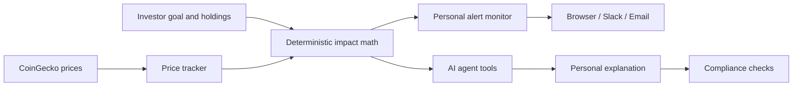

# Crypto Pulse

**A personal crypto risk agent that explains what a market move means for your money before emotion becomes a decision.**

Crypto Pulse monitors live crypto prices, translates losses into portfolio impact, alerts users only when their own configured limits are crossed, and helps them rehearse historical crashes against the assets they hold today.

It is designed as an educational decision-support demo—not a trading platform and not a source of buy or sell recommendations.

## Product tour

### Today

The home screen tells a simple story: what is happening in crypto, what it means for this specific user, and whether anything requires attention.

- Switch between the real market and a labeled crash simulation.
- See total wealth, crypto value, today’s change, and cumulative profit or loss.
- Break impact down by currency, including amount invested and current value.
- See the agent’s live monitoring state and configured alert coverage.
- Replay a demo alert without disguising simulated data as a real event.

### Market

The market page combines current prices with personal exposure instead of presenting generic market headlines.

- Live Bitcoin, Ethereum, and Solana data from CoinGecko.
- Normal-market and crash-scenario views.
- Personalized dollar impact for the selected investor profile.
- A practical response sequence based on exposure, loss boundaries, goals, and timeline.

### Crash Lab

Crash Lab is an interactive learning experience built from historical price paths.

1. Choose a historical crash and a user profile.
2. Apply the same percentage move to today’s holdings.
3. Enter the crash without initially revealing the outcome.
4. Replay the following 30 days and click any day for a personal explanation.
5. Complete a first-response drill: verify exposure, compare the loss with the user’s boundary, check the goal, and schedule the next review.

Cash and non-crypto assets remain flat during the replay so the effect of the crypto move is clear.

### Paper Portfolio

The paper portfolio lets a user practice with live prices without connecting a brokerage or risking real money.

- Start with configurable virtual cash.
- Simulate buying and selling BTC, ETH, and SOL.
- Confirm every virtual order before it is recorded.
- Track current value, cost basis, unrealized gain/loss, and realized gain/loss.
- Clear individual positions or reset the complete simulation.
- Feed simulated holdings into Today, personal alerts, and the agent.

### Your Plan

The plan page keeps personalization explicit and editable.

- Goal and time horizon.
- Total-wealth comfort boundary used by Crash Lab and planning context.
- Per-currency investment-loss alerts.
- A separate combined crypto-portfolio loss alert.
- Estimated dollar loss and trigger value for every configured rule.

Demo profiles are read-only so interview scenarios remain repeatable. The main user profile changes dynamically as holdings and settings change.

### Ask Crypto Pulse

The personal agent is available throughout the product.

- The persistent **Ask Crypto Pulse** button opens a right-side conversation panel.
- Highlighting text anywhere in the app opens a contextual floating prompt beside the selection.
- Answers use the selected profile’s holdings, goal, timeline, and current market context.
- Conversation history is stored locally per profile, so a user can close the panel, return later, and continue.
- AI is called only when the user submits a question or explicitly requests an insight.

## Personalized alerts

Crypto Pulse monitors losses against the amount invested, not merely the latest 24-hour percentage move.

An external alert fires when either:

- an enabled currency holding falls beyond its configured investment-loss limit; or
- the combined crypto portfolio falls beyond its configured investment-loss limit.

The monitor:

- ignores gains, disabled rules, unheld currencies, cash, stocks, and bonds;
- combines simultaneous currency and portfolio crossings into one notification;
- sends once per crossing and re-arms only after a 0.5 percentage-point recovery buffer;
- persists crossing state so restarts do not duplicate alerts;
- names the exact rule crossed and shows the user’s dollar loss;
- supports browser notifications, Slack incoming webhooks, and email through Resend;
- uses deterministic portfolio math and no AI credits.

Demo notifications are clearly labeled and link directly to the relevant simulation experience.

## How the agent works



Portfolio calculations and alert decisions are made in code. Claude receives the computed facts through tools and explains them in context. Compliance checks reject direct buy/sell instructions, guarantees, and unsupported predictions.

## Demo flow

A concise interview walkthrough:

1. Open **Today** and show the live monitoring state.
2. Switch to the crash scenario to demonstrate personalized impact and alert behavior.
3. Open **Market** to explain why the same crash means different things to different profiles.
4. Enter **Crash Lab**, apply a real historical move to the current portfolio, and inspect the 30-day replay.
5. Use **Paper Portfolio** to make a confirmed virtual trade and show Today update.
6. Open **Your Plan** to change per-currency or combined-portfolio alert limits.
7. Highlight a number or sentence and ask Crypto Pulse about it, then reopen the sidebar to continue the saved conversation.

## Tech stack

- **Frontend:** Next.js 14 App Router, React, TypeScript, Tailwind CSS, Recharts
- **Application server:** custom Node server with Socket.IO
- **Database:** PostgreSQL with Prisma
- **Realtime/cache:** Redis for market caching, rolling statistics, and pub/sub
- **Market data:** CoinGecko with caching and stale-data fallbacks
- **AI:** Anthropic Claude with a traced tool loop and streamed answers
- **Notifications:** browser notifications, Slack webhooks, and Resend email
- **Deployment:** Docker and a Render Blueprint

## Architecture map

| Path | Responsibility |
|---|---|
| `app/page.tsx` | Today experience, live/crash modes, personalized money view |
| `app/markets/page.tsx` | Live market and personalized crash scenario |
| `app/practice/page.tsx` | Crash Lab entry, replay, guide, and response drill |
| `app/paper/page.tsx` | Virtual portfolio and trade ledger |
| `app/portfolio/edit/page.tsx` | Goals, holdings, comfort boundary, and alert settings |
| `components/AskDrawer.tsx` | Global sidebar agent, contextual selection prompt, saved history |
| `services/portfolioAlertMonitor.ts` | Per-currency and combined-crypto crossing detection |
| `services/crashNotifier.ts` | Slack and email notification delivery |
| `services/agentCore.ts` | Shared AI tool loop, trace, usage, and cost accounting |
| `lib/impact.ts` | Deterministic portfolio impact calculations |
| `lib/compliance.ts` | Advice, prediction, and guarantee guardrails |
| `app/api/paper/route.ts` | Paper portfolio valuation and virtual trade execution |

## Local setup

### Prerequisites

- Node.js 20+
- Docker Desktop, or local PostgreSQL and Redis instances
- An Anthropic API key only if AI answers and generated insights are needed

### Run the app

```bash
npm install
cp .env.example .env
docker compose up -d db redis
npx prisma db push
npx prisma db seed
npm run dev:server
```

Open [http://localhost:3000](http://localhost:3000).

The `.env` file is ignored by Git. Keep all API keys and webhook URLs there and commit only `.env.example`.

### Environment variables

| Variable | Required | Purpose |
|---|---:|---|
| `DATABASE_URL` | Yes | PostgreSQL connection |
| `REDIS_URL` | Yes | Redis connection |
| `ANTHROPIC_API_KEY` | For AI features | Agent answers and generated insights |
| `APP_URL` | For external alerts | Base URL used in Slack/email links |
| `SLACK_WEBHOOK_URL` | Optional | Slack incoming webhook |
| `RESEND_API_KEY` | Optional | Resend API key |
| `ALERT_EMAIL_FROM` | Optional | Verified sender address |
| `ALERT_EMAIL_TO` | Optional | Alert recipient |

## Validation

```bash
npm run lint
npm run build
npm run build:server
npm run eval
git diff --check
```

`npm run eval` checks saved insights without calling the model. It verifies factual grounding, portfolio math, urgency consistency, length, citations, and the absence of prohibited financial advice.

## Docker

Run the complete app, PostgreSQL, and Redis stack:

```bash
docker compose up -d --build
```

The app exposes a health endpoint at `/api/health`.

## Deploy with Render

`render.yaml` defines the Docker web service, PostgreSQL database, Redis-compatible key-value service, environment variables, and health check.

1. Create a new Render Blueprint from this repository.
2. Add `ANTHROPIC_API_KEY` if the AI features should be enabled.
3. Optionally add Slack or Resend credentials.
4. Set `APP_URL` to the deployed public URL if it is not populated automatically.
5. Apply the Prisma schema and seed the initial demo data for a new database.

## Safety and scope

- Educational context only; not financial advice.
- No real brokerage connection and no real orders.
- Paper trades use virtual cash but live market prices.
- Historical replays explain past paths; they do not predict future recovery.
- Market-data availability is subject to the upstream provider and configured cache.

## Built with AI

Crypto Pulse was designed and built by Manaswi with Claude as an AI development collaborator. The prompts, evaluation approach, mistakes, safeguards, and demo workflow are documented in [How I Built Crypto Pulse with AI](BUILDING_WITH_AI.md).
